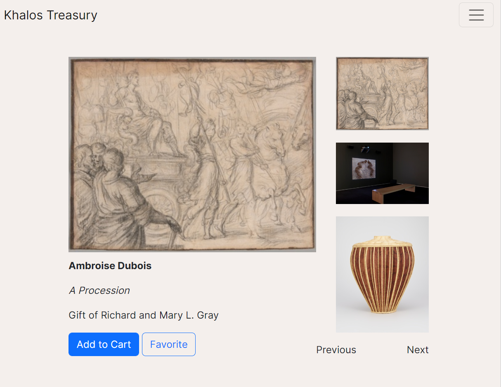

# Khalos Treasury - Phase 1 Project

Khalos Treasury is a single page application (SPA) which uses a free API from the Art Institute of Chicago. The API documentation can be found [here](https://api.artic.edu/docs/#introduction)

### How it works

### Features

- Users can browse the Art Institute of Chicago's vast collection of images.
- Users can save their favorite pieces to a favorites list. 
- There is also an option to buy a print of an artwork with the Add to Cart feature. 

### Creators

Leela Khadka - Software Engineer
khadkaleela3@gmail.com

Megan Moulos - Software Engineer
meganmoulos@gmail.com